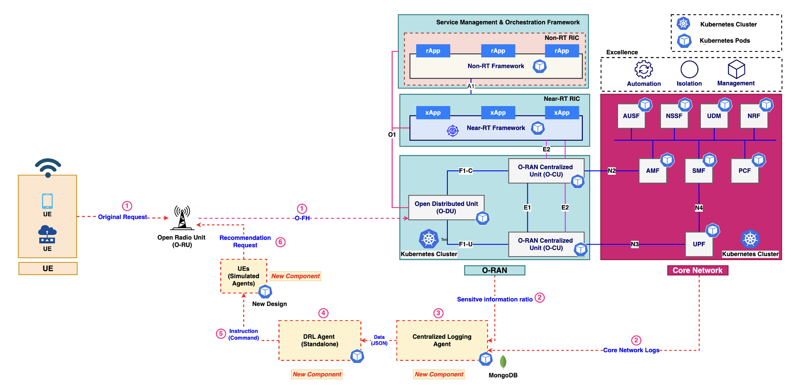

# ORAN-virtualization



This repository contains the source code and deployment manifests for the ORAN project. It includes:

* **DRL Agent:** Uses deep reinforcement learning to dynamically adjust network parameters.
* **Centralized Logging Agent:** Aggregates real-time logging data and calculates the ratio of sensitive to total requests.
* **UE Simulated Agent:** Simulates user equipment traffic to test and validate network behavior.
* **ORAN Core:** Provides the central orchestration and control for the ORAN ecosystem.

These components work together to optimize network performance and provide real-time insights in an ORAN deployment.

## Table of Contents

* [Architecture](#architecture)
* [Prerequisites](#prerequisites)
* [Installation](#installation)
  * [1. Kubernetes Installation](#1-kubernetes-installation)
  * [2. ORAN Core Deployment](#2-oran-core-deployment)
  * [3. Deploying the ORAN Components](#3-deploying-the-oran-components)
* [Configuration](#configuration)
* [Usage](#usage)
* [API Example](#api-example)
* [Testing and Troubleshooting](#testing-and-troubleshooting)
* [Contributing](#contributing)

## Architecture

* **DRL Agent:**
  Processes real-time sensitive ratio data and uses DRL algorithms to adjust network parameters dynamically.
* **Centralized Logging Agent:**
  Collects logs from various components, calculates the sensitive request ratio, and exposes the data via a REST API.
* **UE Simulated Agent:**
  Generates realistic user equipment traffic for simulation and testing of the ORAN ecosystem.
* **ORAN Core:**
  Acts as the backbone of the project, coordinating the interactions between agents and ensuring network efficiency.

## Prerequisites

* **Operating System:** Linux, macOS (Windows users can use WSL2)
* **Docker:** Installed and running
* **Kubernetes:** A cluster set up using Minikube, kind, or a cloud provider
* **Helm 3:** Installed for managing Kubernetes deployments
* **Git:** For cloning the repository

## Installation

### 1. Kubernetes Installation

You can use [Minikube]() or [kind]() to set up a local Kubernetes cluster.

#### Using Minikube on macOS (with Homebrew):

```bash
# Download and install Minikube
curl -Lo minikube https://storage.googleapis.com/minikube/releases/latest/minikube-linux-amd64
chmod +x minikube
sudo mv minikube /usr/local/bin/

# Start the Minikube cluster
minikube start

```

#### Using Minikube on macOS (with Homebrew):

```bash
brew install minikube
minikube start
```

### 2. ORAN Core Deployment

Clone the repository and navigate to the project directory:

```bash
git clone https://github.com/yourusername/oran-project.git
cd oran-project
```

The ORAN Core is deployed via Helm. First, update the Helm dependencies:

```bash
helm dependency update ./charts/oran-core
```

Then install ORAN Core on your Kubernetes cluster:

```bash
helm install oran-core ./charts/oran-core

```

3. Deploying the ORAN Components

Deploy the remaining components (DRL Agent, Centralized Logging Agent, UE Simulated Agent) using the provided Kubernetes YAML manifests:

```bash
# Deploy DRL Agent
kubectl apply -f deployments/drl-agent.yaml

# Deploy Centralized Logging Agent
kubectl apply -f deployments/centralized-logging-agent.yaml

# Deploy UE Simulated Agent
kubectl apply -f deployments/ue-simulated-agent.yaml

```

These deployments will configure your cluster with the necessary pods and services for each component.

## Configuration

* **Environment Variables:**
  Customize parameters such as thresholds and DRL adjustment factors in the configuration files located in the `config/` directory.
* **Logging Settings:**
  Review and modify logging configurations in `config/logging.yaml` to suit your monitoring needs.

## Usage

After deployment, check the status of your pods with:

<pre class="!overflow-visible" data-start="4121" data-end="4149"><div class="contain-inline-size rounded-md border-[0.5px] border-token-border-medium relative bg-token-sidebar-surface-primary dark:bg-gray-950"><div class="flex items-center text-token-text-secondary px-4 py-2 text-xs font-sans justify-between rounded-t-[5px] h-9 bg-token-sidebar-surface-primary dark:bg-token-main-surface-secondary select-none">bash</div><div class="sticky top-9 md:top-[5.75rem]"><div class="absolute bottom-0 right-2 flex h-9 items-center"><div class="flex items-center rounded bg-token-sidebar-surface-primary px-2 font-sans text-xs text-token-text-secondary dark:bg-token-main-surface-secondary"><span class="" data-state="closed"><button class="flex gap-1 items-center select-none px-4 py-1" aria-label="Copy"><svg width="24" height="24" viewBox="0 0 24 24" fill="none" xmlns="http://www.w3.org/2000/svg" class="icon-xs"><path fill-rule="evenodd" clip-rule="evenodd" d="M7 5C7 3.34315 8.34315 2 10 2H19C20.6569 2 22 3.34315 22 5V14C22 15.6569 20.6569 17 19 17H17V19C17 20.6569 15.6569 22 14 22H5C3.34315 22 2 20.6569 2 19V10C2 8.34315 3.34315 7 5 7H7V5ZM9 7H14C15.6569 7 17 8.34315 17 10V15H19C19.5523 15 20 14.5523 20 14V5C20 4.44772 19.5523 4 19 4H10C9.44772 4 9 4.44772 9 5V7ZM5 9C4.44772 9 4 9.44772 4 10V19C4 19.5523 4.44772 20 5 20H14C14.5523 20 15 19.5523 15 19V10C15 9.44772 14.5523 9 14 9H5Z" fill="currentColor"></path></svg>Copy</button></span></div></div></div><div class="overflow-y-auto p-4" dir="ltr"><code class="!whitespace-pre language-bash"><span>kubectl get pods
</span></code></div></div></pre>

To access the ORAN Core dashboard (if provided), use port forwarding:

<pre class="!overflow-visible" data-start="4222" data-end="4276"><div class="contain-inline-size rounded-md border-[0.5px] border-token-border-medium relative bg-token-sidebar-surface-primary dark:bg-gray-950"><div class="flex items-center text-token-text-secondary px-4 py-2 text-xs font-sans justify-between rounded-t-[5px] h-9 bg-token-sidebar-surface-primary dark:bg-token-main-surface-secondary select-none">bash</div><div class="sticky top-9 md:top-[5.75rem]"><div class="absolute bottom-0 right-2 flex h-9 items-center"><div class="flex items-center rounded bg-token-sidebar-surface-primary px-2 font-sans text-xs text-token-text-secondary dark:bg-token-main-surface-secondary"><span class="" data-state="closed"><button class="flex gap-1 items-center select-none px-4 py-1" aria-label="Copy"><svg width="24" height="24" viewBox="0 0 24 24" fill="none" xmlns="http://www.w3.org/2000/svg" class="icon-xs"><path fill-rule="evenodd" clip-rule="evenodd" d="M7 5C7 3.34315 8.34315 2 10 2H19C20.6569 2 22 3.34315 22 5V14C22 15.6569 20.6569 17 19 17H17V19C17 20.6569 15.6569 22 14 22H5C3.34315 22 2 20.6569 2 19V10C2 8.34315 3.34315 7 5 7H7V5ZM9 7H14C15.6569 7 17 8.34315 17 10V15H19C19.5523 15 20 14.5523 20 14V5C20 4.44772 19.5523 4 19 4H10C9.44772 4 9 4.44772 9 5V7ZM5 9C4.44772 9 4 9.44772 4 10V19C4 19.5523 4.44772 20 5 20H14C14.5523 20 15 19.5523 15 19V10C15 9.44772 14.5523 9 14 9H5Z" fill="currentColor"></path></svg>Copy</button></span></div></div></div><div class="overflow-y-auto p-4" dir="ltr"><code class="!whitespace-pre language-bash"><span>kubectl port-forward svc/oran-core 8080:80
</span></code></div></div></pre>

Real-time data will be sent from the UE Simulated Agent to the Centralized Logging Agent. The logging agent processes this data and makes it available via its REST API for the DRL Agent to use.

## API Example

The Centralized Logging Agent exposes an API endpoint to accept sensitive ratio data. An example JSON payload and API call are provided below:

### JSON Data Template

<pre class="!overflow-visible" data-start="4657" data-end="4791"><div class="contain-inline-size rounded-md border-[0.5px] border-token-border-medium relative bg-token-sidebar-surface-primary dark:bg-gray-950"><div class="flex items-center text-token-text-secondary px-4 py-2 text-xs font-sans justify-between rounded-t-[5px] h-9 bg-token-sidebar-surface-primary dark:bg-token-main-surface-secondary select-none">json</div><div class="sticky top-9 md:top-[5.75rem]"><div class="absolute bottom-0 right-2 flex h-9 items-center"><div class="flex items-center rounded bg-token-sidebar-surface-primary px-2 font-sans text-xs text-token-text-secondary dark:bg-token-main-surface-secondary"><span class="" data-state="closed"><button class="flex gap-1 items-center select-none px-4 py-1" aria-label="Copy"><svg width="24" height="24" viewBox="0 0 24 24" fill="none" xmlns="http://www.w3.org/2000/svg" class="icon-xs"><path fill-rule="evenodd" clip-rule="evenodd" d="M7 5C7 3.34315 8.34315 2 10 2H19C20.6569 2 22 3.34315 22 5V14C22 15.6569 20.6569 17 19 17H17V19C17 20.6569 15.6569 22 14 22H5C3.34315 22 2 20.6569 2 19V10C2 8.34315 3.34315 7 5 7H7V5ZM9 7H14C15.6569 7 17 8.34315 17 10V15H19C19.5523 15 20 14.5523 20 14V5C20 4.44772 19.5523 4 19 4H10C9.44772 4 9 4.44772 9 5V7ZM5 9C4.44772 9 4 9.44772 4 10V19C4 19.5523 4.44772 20 5 20H14C14.5523 20 15 19.5523 15 19V10C15 9.44772 14.5523 9 14 9H5Z" fill="currentColor"></path></svg>Copy</button></span></div></div></div><div class="overflow-y-auto p-4" dir="ltr"><code class="!whitespace-pre language-json"><span>{
  "timestamp": "2025-02-26T15:00:00Z",
  "total_requests": 1000,
  "sensitive_requests": 300,
  "sensitive_ratio": 0.3
}
</span></code></div></div></pre>

### Sample API Call Using `curl`:

<pre class="!overflow-visible" data-start="4828" data-end="5132"><div class="contain-inline-size rounded-md border-[0.5px] border-token-border-medium relative bg-token-sidebar-surface-primary dark:bg-gray-950"><div class="flex items-center text-token-text-secondary px-4 py-2 text-xs font-sans justify-between rounded-t-[5px] h-9 bg-token-sidebar-surface-primary dark:bg-token-main-surface-secondary select-none">bash</div><div class="sticky top-9 md:top-[5.75rem]"><div class="absolute bottom-0 right-2 flex h-9 items-center"><div class="flex items-center rounded bg-token-sidebar-surface-primary px-2 font-sans text-xs text-token-text-secondary dark:bg-token-main-surface-secondary"><span class="" data-state="closed"><button class="flex gap-1 items-center select-none px-4 py-1" aria-label="Copy"><svg width="24" height="24" viewBox="0 0 24 24" fill="none" xmlns="http://www.w3.org/2000/svg" class="icon-xs"><path fill-rule="evenodd" clip-rule="evenodd" d="M7 5C7 3.34315 8.34315 2 10 2H19C20.6569 2 22 3.34315 22 5V14C22 15.6569 20.6569 17 19 17H17V19C17 20.6569 15.6569 22 14 22H5C3.34315 22 2 20.6569 2 19V10C2 8.34315 3.34315 7 5 7H7V5ZM9 7H14C15.6569 7 17 8.34315 17 10V15H19C19.5523 15 20 14.5523 20 14V5C20 4.44772 19.5523 4 19 4H10C9.44772 4 9 4.44772 9 5V7ZM5 9C4.44772 9 4 9.44772 4 10V19C4 19.5523 4.44772 20 5 20H14C14.5523 20 15 19.5523 15 19V10C15 9.44772 14.5523 9 14 9H5Z" fill="currentColor"></path></svg>Copy</button></span></div></div></div><div class="overflow-y-auto p-4" dir="ltr"><code class="!whitespace-pre language-bash"><span>curl -X POST http://<centralized-logging-agent-ip>/api/sensitive-data \
     -H "Content-Type: application/json" \
     -d '{
           "timestamp": "2025-02-26T15:00:00Z",
           "total_requests": 1000,
           "sensitive_requests": 300,
           "sensitive_ratio": 0.3
         }'
</span></code></div></div></pre>

## Testing and Troubleshooting

* **Validate Deployments:**
  Use `kubectl get pods` and `kubectl logs <pod-name>` to monitor and troubleshoot your pods.
* **Service Access:**
  Verify that your services are reachable by checking endpoints and using port-forwarding when necessary.
* **Configuration Errors:**
  Use `kubectl describe pod <pod-name>` for detailed error messages if a pod fails to start or behaves unexpectedly.
* **Helm Issues:**
  Ensure that you are using Helm 3 and that your Kubernetes context is correctly set.
